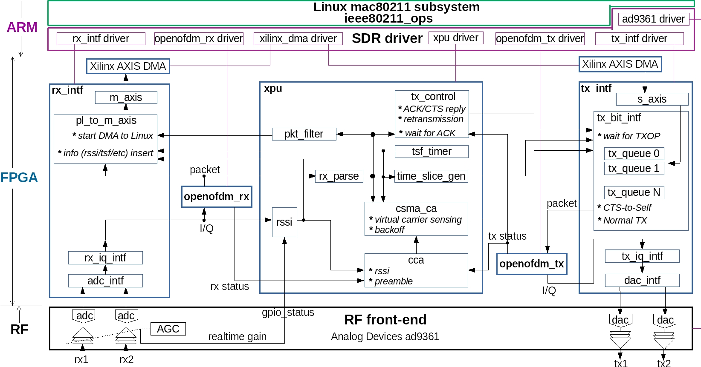
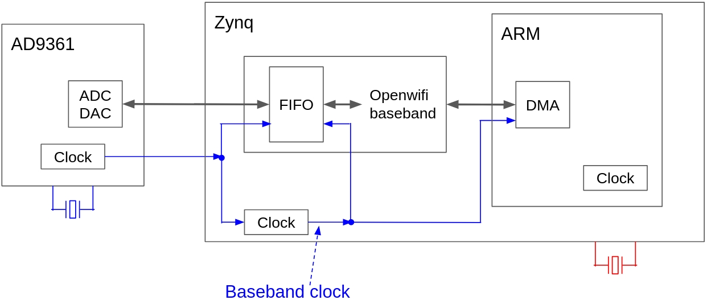
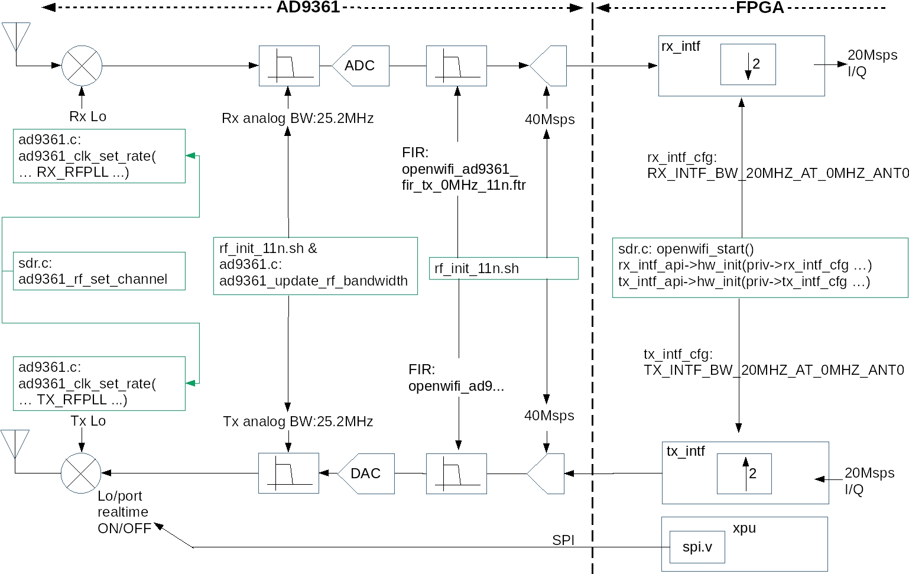
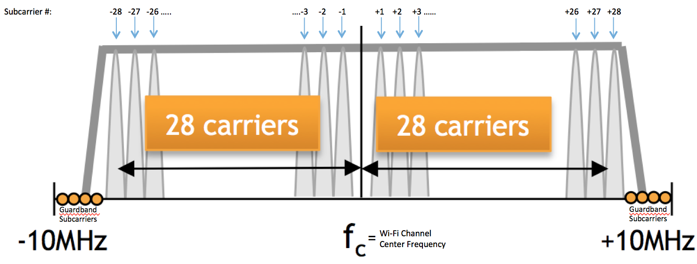
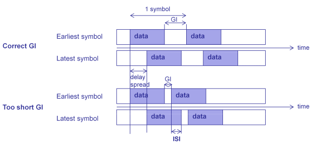
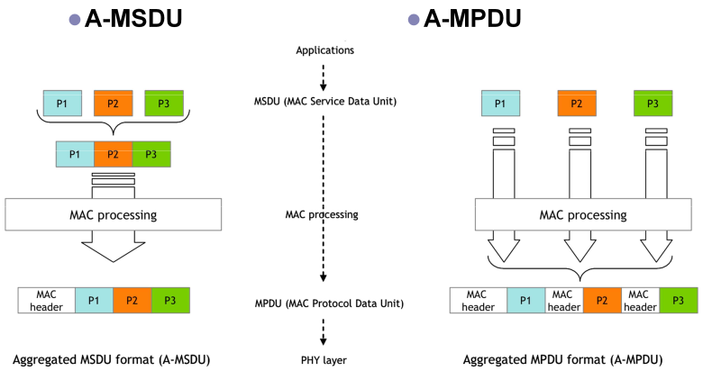

# Architecture Overview

This page explains how openwifi is put together. Read it before you start modifying code. Almost every "how do I…" question becomes obvious once you understand the split between Linux, the driver, and the FPGA. (For *where* each part lives in the source tree, see [The Repositories](Repositories.md); for the FPGA cores in depth, see [FPGA IP Cores](FPGA-IP-Cores.md).)

*openwifi's full composition: software modules (top) and FPGA modules (bottom). The module names in this diagram match the source file names (`xpu`, `openofdm_tx/rx`, `tx_intf`, `rx_intf`, `side_ch`), which is the key to navigating both the code and this wiki.*

## The big picture

openwifi is a **SoftMAC** Wi-Fi design. The word "soft" refers to where the *upper* MAC lives: management, association, and higher-layer logic run in software (Linux `mac80211`), exactly as they do for a commercial SoftMAC chip. What makes openwifi unusual is that the **PHY and the timing-critical low MAC live in FPGA fabric** that you can read, modify, and rebuild.

Layered from top to bottom:

- **Linux user space**: `hostapd`, `wpa_supplicant`, `iw`, `dhclient`, `tcpdump`, plus openwifi's own `sdrctl` tool and helper scripts.
- **Linux kernel: cfg80211 / mac80211**: the generic Linux wireless stack. Handles the upper MAC and calls into the driver through a fixed API.
- **openwifi driver (`driver/sdr.c` and friends)**: a SoftMAC driver that implements the mac80211 API and translates it into FPGA register writes and DMA transfers.
- **FPGA design (the openwifi-hw repo)**: OFDM transmitter and receiver, the CSMA/CA low MAC, and DMA interfaces to the processor.
- **AD9361 RF front end**: the analog radio (70 MHz–6 GHz), connected to the FPGA over the Analog Devices RF interface and controlled in real time over an FPGA-driven SPI link.

Because it registers a normal Linux network interface (`sdr0`), every tool that works with a commercial card works here too, which is the core idea behind openwifi.

<figure class="ow-svgfig">
<svg viewBox="0 0 760 800" width="760" height="800" role="img"
     aria-label="openwifi architecture: software on the ARM cores (PS) drives the openwifi-hw FPGA fabric (PL) over the AXI bus, and the PHY drives the AD9361 RF front end."
     style="max-width:100%;height:auto;color:var(--md-default-fg-color);font-family:var(--md-text-font-family,inherit)">
  <defs>
    <marker id="ow-arrow" viewBox="0 0 10 10" refX="9" refY="5"
            markerWidth="7" markerHeight="7" orient="auto-start-reverse">
      <path d="M0,0 L10,5 L0,10 z" fill="currentColor"/>
    </marker>
  </defs>

  <!-- ===== Container: Software (PS) ===== -->
  <rect x="30" y="40" width="700" height="290" rx="12"
        fill="currentColor" fill-opacity="0.025"
        stroke="currentColor" stroke-opacity="0.22" stroke-width="1.2"/>
  <text x="48" y="66" text-anchor="start" font-size="12.5" font-weight="600"
        fill="currentColor" fill-opacity="0.72">Software — Linux on the ARM cores (PS)</text>

  <!-- Container: FPGA fabric (PL) -->
  <rect x="30" y="380" width="700" height="270" rx="12"
        fill="currentColor" fill-opacity="0.025"
        stroke="currentColor" stroke-opacity="0.22" stroke-width="1.2"/>
  <text x="48" y="406" text-anchor="start" font-size="12.5" font-weight="600"
        fill="currentColor" fill-opacity="0.72">FPGA fabric (PL) — the openwifi-hw design</text>

  <!-- ===== Connectors (drawn before nodes so borders sit on top) ===== -->
  <g fill="none" stroke="currentColor" stroke-width="1.6" stroke-opacity="0.8">
    <!-- tools -> stack -> drv -->
    <path d="M380,142 V166" marker-end="url(#ow-arrow)"/>
    <path d="M380,224 V248" marker-end="url(#ow-arrow)"/>
    <!-- drv <-> intf : AXI bus (straight, crosses both container borders) -->
    <path d="M380,306 V424" marker-start="url(#ow-arrow)" marker-end="url(#ow-arrow)"/>
    <!-- intf <-> lowmac / phy : right-angle fan-out -->
    <path d="M330,482 V512 H215 V560" marker-start="url(#ow-arrow)" marker-end="url(#ow-arrow)"/>
    <path d="M430,482 V512 H545 V560" marker-start="url(#ow-arrow)" marker-end="url(#ow-arrow)"/>
    <!-- PL fabric <-> rf : the whole FPGA fabric interfaces to RF
         (I/Q via the iq_intf/adc/dac blocks, gain/AGC via xpu) -->
    <path d="M380,650 V712" marker-start="url(#ow-arrow)" marker-end="url(#ow-arrow)"/>
  </g>

  <!-- Edge labels (offset from the lines so nothing strikes through) -->
  <g font-size="11.5" fill="currentColor" fill-opacity="0.7">
    <text x="396" y="356" text-anchor="start">AXI bus:</text>
    <text x="396" y="371" text-anchor="start">register writes + DMA</text>
    <text x="396" y="676" text-anchor="start">I/Q samples ·</text>
    <text x="396" y="691" text-anchor="start">realtime gain/AGC</text>
  </g>

  <!-- ===== Nodes ===== -->
  <g font-size="12.5" text-anchor="middle">
    <!-- PS nodes (teal) -->
    <g>
      <rect x="205" y="84" width="350" height="58" rx="8" fill="#0d9488" fill-opacity="0.12" stroke="#0d9488" stroke-width="1.4"/>
      <text fill="currentColor"><tspan x="380" y="108">User space</tspan><tspan x="380" dy="17">hostapd · wpa_supplicant · iw · tcpdump · sdrctl</tspan></text>
      <rect x="205" y="166" width="350" height="58" rx="8" fill="#0d9488" fill-opacity="0.12" stroke="#0d9488" stroke-width="1.4"/>
      <text fill="currentColor"><tspan x="380" y="190">Kernel: cfg80211 / mac80211</tspan><tspan x="380" dy="17">the upper MAC (association, management)</tspan></text>
      <rect x="205" y="248" width="350" height="58" rx="8" fill="#0d9488" fill-opacity="0.12" stroke="#0d9488" stroke-width="1.4"/>
      <text fill="currentColor"><tspan x="380" y="272">openwifi driver (sdr.c)</tspan><tspan x="380" dy="17">implements the mac80211 API · creates NIC sdr0</tspan></text>
    </g>
    <!-- PL nodes (indigo) -->
    <g>
      <rect x="205" y="424" width="350" height="58" rx="8" fill="#6366f1" fill-opacity="0.12" stroke="#6366f1" stroke-width="1.4"/>
      <text fill="currentColor"><tspan x="380" y="448">tx_intf / rx_intf / side_ch</tspan><tspan x="380" dy="17">DMA + per-packet metadata</tspan></text>
      <rect x="70" y="560" width="290" height="64" rx="8" fill="#6366f1" fill-opacity="0.12" stroke="#6366f1" stroke-width="1.4"/>
      <text fill="currentColor"><tspan x="215" y="587">xpu — real-time low MAC</tspan><tspan x="215" dy="17">CSMA/CA · hardware ACK · TSF timer</tspan></text>
      <rect x="400" y="560" width="290" height="64" rx="8" fill="#6366f1" fill-opacity="0.12" stroke="#6366f1" stroke-width="1.4"/>
      <text fill="currentColor"><tspan x="545" y="587">openofdm_tx / openofdm_rx</tspan><tspan x="545" dy="17">OFDM PHY</tspan></text>
    </g>
    <!-- RF front end (neutral: external analog part) -->
    <rect x="230" y="712" width="300" height="60" rx="8" fill="currentColor" fill-opacity="0.05" stroke="currentColor" stroke-opacity="0.45" stroke-width="1.4"/>
    <text fill="currentColor"><tspan x="380" y="737">AD9361 RF front end</tspan><tspan x="380" dy="17">70 MHz–6 GHz</tspan></text>
  </g>
</svg>
<figcaption>The SoftMAC split. Teal = software on the Linux/ARM cores (PS): the upper MAC and everything above it. Indigo = the openwifi-hw design in FPGA fabric (PL) you can read and rebuild: the low MAC (<code>xpu</code>) and the PHY. The processor reaches every FPGA core over the AXI bus; the AD9361 RF front end is the external analog radio.</figcaption>
</figure>

## How the driver talks to Linux: the mac80211 API

The Linux `mac80211` subsystem defines a set of callbacks (`ieee80211_ops`) that every SoftMAC driver implements. That shared contract is why one kernel can drive Wi-Fi chips from dozens of vendors. openwifi's `sdr.c` implements the relevant subset. The most important callbacks:

| Callback | When Linux calls it |
|---|---|
| `tx` | There's a packet to transmit |
| `start` / `stop` | The NIC is brought up / down (`ifconfig sdr0 up/down`) |
| `add_interface` / `remove_interface` | A virtual interface is created / deleted |
| `config` | Channel / frequency change (e.g. during a scan) |
| `bss_info_changed` | BSS parameters change (BSSID, TX power, beacon interval…) |
| `conf_tx` | TX parameters change (AIFS, CW_MIN, CW_MAX, TXOP) |
| `configure_filter` | Frame-filtering rules change |
| `set_antenna` / `get_antenna` | Select / read the TX/RX antenna |
| `get_tsf` / `set_tsf` / `reset_tsf` | Read / write / reset the 64-bit TSF hardware timer |
| `set_rts_threshold` | Change the packet length that triggers RTS/CTS |
| `ampdu_action` | A-MPDU (aggregation) operations |
| `testmode_cmd` | Handles `sdrctl` commands (see [sdrctl](sdrctl-and-Runtime-Control.md)) |

When Linux invokes one of these, `sdr.c` does the work by driving the FPGA. It leans on per-block helper "sub-drivers" (`tx_intf_api`, `rx_intf_api`, `openofdm_tx_api`, `openofdm_rx_api`, and `xpu_api`), each of which wraps register access to one FPGA module. These are compiled as separate kernel modules (`tx_intf.ko`, `rx_intf.ko`, …) that `sdr.ko` binds to at load time, which is why `wgd.sh` inserts all of them.

A few implementation facts worth knowing:

- openwifi is a Linux **platform driver** (not PCI or USB): it binds to a device-tree node with `compatible = "sdr,sdr"`. The device tree is what tells Linux the AXI addresses and interrupts of every FPGA block, which is why [porting a board](FPGA-Development.md#porting-to-a-new-board) is largely a device-tree exercise.
- At probe time (`openwifi_dev_probe()`) the driver reads the device-tree `model` string to detect the **hardware type** (`ZYNQ_AD9361`, `ZYNQMP_AD9361`, `RFSOC4X2`) and whether it's a **small or large FPGA**. That last distinction is how features like capture-buffer length adapt per board automatically.
- The AD9361 RF chip is itself driven by the standard Analog Devices IIO driver; openwifi finds it on the SPI bus and calls into it (e.g. `ad9361_set_tx_atten`, `ad9361_do_calib_run`). This is also why some patches to the ADI kernel are needed (see [Software Development Workflow](Software-Development-Workflow.md#rebuilding-the-driver)).
- TX uses a 64-entry DMA ring of buffer descriptors; RX uses a cyclic DMA buffer. The driver keeps write/read indices so the running `openwifi_tx()`, the FPGA, and the interrupt handler can cross-check each other.

## The FPGA modules

The FPGA design decomposes into modules whose names match their source files (in `openwifi-hw/ip/`). Understanding these five names unlocks most of the register documentation:

- **`openofdm_tx`**: the OFDM transmitter. Turns a MAC frame into baseband IQ samples (PHY header, pilots, scrambling, modulation). Based on original openwifi work.
- **`openofdm_rx`**: the OFDM receiver. Detects the preamble, synchronizes, estimates the channel, equalizes, and decodes (including a Xilinx Viterbi decoder). Derived from the [openofdm](https://github.com/open-sdr/openofdm) project (originally by [jhshi](https://github.com/jhshi/openofdm); openwifi's improvements live on the `dot11zynq` branch).
- **`tx_intf`**: the transmit interface: DMA from the processor into per-queue FIFOs, the DAC feed, per-packet PHY configuration, and the four hardware TX queues.
- **`rx_intf`**: the receive interface: takes decoded packets and side-channel data, attaches metadata (TSF timestamp, RSSI, length, MCS, FCS status), and DMAs them up to the processor.
- **`xpu`**: the "eXtensible Processing Unit," which holds the **real-time low MAC**: the CSMA/CA state machine, NAV, DIFS/SIFS/EIFS timing, the TSF timer, hardware ACK generation and reception, retransmission, RTS/CTS, packet filtering, and the time-slicing gates for the TX queues. If a behavior has to happen in microseconds, it's in `xpu`.

There's also a **`side_ch`** (side channel) module used for research features (CSI and IQ capture), described on the [Research Features](Research-Features.md) page.

The processor reaches these modules over the ARM **AXI bus**. Each module exposes a bank of registers (`slv_regN` in the Verilog), whose addresses are defined in `driver/hw_def.h`. This AXI coupling is what gives openwifi very low processor↔PHY latency, and also what makes the design fairly platform-specific.

For a core-by-core walkthrough, see the dedicated [FPGA IP Cores](FPGA-IP-Cores.md) page: the submodules inside `xpu` (the CSMA/CA state machine, TSF timer, hardware SPI to the AD9361), the OFDM transmit and receive chains, and how a register write travels from `sdrctl` all the way to a `slv_regN`.

openwifi's FPGA design is built **on top of the [Analog Devices HDL reference design](https://github.com/analogdevicesinc/hdl)** (vendored as the `adi-hdl` submodule of openwifi-hw): ADI provides the AD9361 interfacing IP, DMA engines, and board plumbing, and openwifi inserts its own cores into that design. This is why [porting to a new board](FPGA-Development.md#porting-to-a-new-board) is framed as "diff openwifi against the matching ADI reference design."

## Packet flow at a glance

Before the step-by-step walkthroughs, here is the whole packet path in one picture. Transmit runs top to bottom from Linux out to the antenna; receive runs back up.

<figure>
<svg viewBox="0 0 920 300" role="img" aria-label="openwifi packet flow. Transmit (top): Linux mac80211 openwifi_tx to tx_intf (four TX queues) to openofdm_tx to the AD9361 and antenna. Receive (bottom): AD9361 to openofdm_rx to rx_intf to the openwifi rx interrupt back up to Linux." style="width:100%;height:auto;max-width:1000px;font-family:inherit;font-size:13px">
  <defs>
    <marker id="pf-arrow" viewBox="0 0 10 10" refX="8.5" refY="5" markerWidth="7" markerHeight="7" orient="auto-start-reverse">
      <path d="M0,0 L10,5 L0,10 z" fill="currentColor" fill-opacity="0.6"/>
    </marker>
  </defs>

  <!-- lane labels -->
  <text x="391" y="88" text-anchor="middle" font-size="10" font-weight="700" fill="#0d9488" letter-spacing="0.08em">TRANSMIT →</text>
  <text x="391" y="262" text-anchor="middle" font-size="10" font-weight="700" fill="#4f5bd5" letter-spacing="0.08em">← RECEIVE</text>

  <!-- endpoints (span both lanes) -->
  <rect x="12" y="96" width="120" height="144" rx="12" fill="currentColor" fill-opacity="0.04" stroke="currentColor" stroke-opacity="0.4" stroke-width="1.3"/>
  <text x="72" y="162" text-anchor="middle" font-size="13" font-weight="700" fill="currentColor">Linux</text>
  <text x="72" y="180" text-anchor="middle" font-size="11" fill="currentColor" fill-opacity="0.7">mac80211</text>
  <rect x="788" y="96" width="120" height="144" rx="12" fill="currentColor" fill-opacity="0.05" stroke="currentColor" stroke-opacity="0.45" stroke-width="1.3" stroke-dasharray="4 3"/>
  <text x="848" y="162" text-anchor="middle" font-size="13" font-weight="700" fill="currentColor">AD9361 RF</text>
  <text x="848" y="180" text-anchor="middle" font-size="11" fill="currentColor" fill-opacity="0.7">→ antenna</text>

  <!-- TX lane arrows -->
  <g stroke="currentColor" stroke-opacity="0.55" stroke-width="1.6" fill="none">
    <line x1="132" y1="122" x2="150" y2="122" marker-end="url(#pf-arrow)"/>
    <line x1="288" y1="122" x2="322" y2="122" marker-end="url(#pf-arrow)"/>
    <line x1="460" y1="122" x2="494" y2="122" marker-end="url(#pf-arrow)"/>
    <line x1="632" y1="122" x2="788" y2="122" marker-end="url(#pf-arrow)"/>
  </g>
  <!-- TX boxes (teal) -->
  <rect x="150" y="96" width="138" height="52" rx="10" fill="#0d9488" fill-opacity="0.05" stroke="#0d9488" stroke-opacity="0.5" stroke-width="1.3"/>
  <text x="219" y="117" text-anchor="middle" font-size="12" font-weight="700" fill="#0d9488">openwifi_tx()</text>
  <text x="219" y="132" text-anchor="middle" font-size="9" fill="currentColor" fill-opacity="0.7">driver builds config</text>
  <rect x="322" y="96" width="138" height="52" rx="10" fill="#0d9488" fill-opacity="0.05" stroke="#0d9488" stroke-opacity="0.5" stroke-width="1.3"/>
  <text x="391" y="117" text-anchor="middle" font-size="12.5" font-weight="700" fill="#0d9488">tx_intf</text>
  <text x="391" y="132" text-anchor="middle" font-size="9" fill="currentColor" fill-opacity="0.7">4 TX queues, DMA</text>
  <rect x="494" y="96" width="138" height="52" rx="10" fill="#0d9488" fill-opacity="0.05" stroke="#0d9488" stroke-opacity="0.5" stroke-width="1.3"/>
  <text x="563" y="117" text-anchor="middle" font-size="12.5" font-weight="700" fill="#0d9488">openofdm_tx</text>
  <text x="563" y="132" text-anchor="middle" font-size="9" fill="currentColor" fill-opacity="0.7">OFDM modulate</text>

  <!-- RX lane arrows (right to left) -->
  <g stroke="currentColor" stroke-opacity="0.55" stroke-width="1.6" fill="none">
    <line x1="788" y1="214" x2="632" y2="214" marker-end="url(#pf-arrow)"/>
    <line x1="494" y1="214" x2="460" y2="214" marker-end="url(#pf-arrow)"/>
    <line x1="322" y1="214" x2="288" y2="214" marker-end="url(#pf-arrow)"/>
    <line x1="150" y1="214" x2="132" y2="214" marker-end="url(#pf-arrow)"/>
  </g>
  <!-- RX boxes (indigo) -->
  <rect x="494" y="188" width="138" height="52" rx="10" fill="#4f5bd5" fill-opacity="0.05" stroke="#4f5bd5" stroke-opacity="0.5" stroke-width="1.3"/>
  <text x="563" y="209" text-anchor="middle" font-size="12.5" font-weight="700" fill="#4f5bd5">openofdm_rx</text>
  <text x="563" y="224" text-anchor="middle" font-size="9" fill="currentColor" fill-opacity="0.7">sync · decode</text>
  <rect x="322" y="188" width="138" height="52" rx="10" fill="#4f5bd5" fill-opacity="0.05" stroke="#4f5bd5" stroke-opacity="0.5" stroke-width="1.3"/>
  <text x="391" y="209" text-anchor="middle" font-size="12.5" font-weight="700" fill="#4f5bd5">rx_intf</text>
  <text x="391" y="224" text-anchor="middle" font-size="9" fill="currentColor" fill-opacity="0.7">+ metadata · DMA</text>
  <rect x="150" y="188" width="138" height="52" rx="10" fill="#4f5bd5" fill-opacity="0.05" stroke="#4f5bd5" stroke-opacity="0.5" stroke-width="1.3"/>
  <text x="219" y="209" text-anchor="middle" font-size="12" font-weight="700" fill="#4f5bd5">rx interrupt</text>
  <text x="219" y="224" text-anchor="middle" font-size="8.5" fill="currentColor" fill-opacity="0.7">openwifi_rx_interrupt</text>
</svg>
<figcaption><em>The packet path. <strong>Top (teal) is transmit:</strong> the driver's <code>openwifi_tx()</code> hands a frame through <code>tx_intf</code>'s four TX queues and <code>openofdm_tx</code> to the AD9361; the <code>xpu</code> core releases it when CSMA/CA allows, then raises <code>openwifi_tx_interrupt</code> with the result. <strong>Bottom (indigo) is receive:</strong> <code>openofdm_rx</code> decodes, <code>rx_intf</code> attaches TSF/RSSI/MCS/FCS metadata and DMAs the frame up, and <code>openwifi_rx_interrupt</code> hands it to Linux.</em></figcaption>
</figure>

## The receive path, step by step

1. A signal arrives at the AD9361 and is delivered to the FPGA as IQ samples.
2. `openofdm_rx` detects, synchronizes, and decodes it. Whether the FCS/CRC passes or fails, the packet is offered up if the current frame-filtering rules allow it (in monitor mode, everything is allowed, even bad-CRC frames and control frames like ACKs).
3. `rx_intf` writes the packet plus metadata into a DMA buffer and raises an interrupt.
4. The driver's `openwifi_rx_interrupt()` runs: it pulls the raw buffer, parses out the inserted metadata (TSF timestamp, raw RSSI which is then corrected to dBm per band/channel, length, MCS, FCS-valid flag), and hands the packet and its metadata to Linux via `ieee80211_rx_irqsafe()`.

## The transmit path, step by step

1. Linux `mac80211` calls `openwifi_tx()` with a frame to send.
2. The driver reads what it needs from the 802.11 header and mac80211 metadata: length and MCS; unicast vs broadcast; whether an ACK is required and the maximum number of retransmissions the FPGA may attempt; which TX queue / time slice to use; whether RTS/CTS or CTS-to-self protection applies; whether the driver should insert a sequence number.
3. It maintains an internal write index (`ring->bd_wr_idx`) so that the active `openwifi_tx()`, the FPGA, and the later interrupt handler can cross-check each other.
4. It writes the per-packet FPGA configuration (so the FPGA generates the right PHY header, etc.) and fires a DMA transfer into one of the four FPGA TX queues. The packet may not go out immediately; the FPGA sends it when the channel and the CSMA state machine allow.
5. When the FPGA finishes sending, it raises an interrupt. `openwifi_tx_interrupt()` reads back the result (success or failure, meaning whether an ACK was received, and how many retransmissions happened) and reports it to Linux via `ieee80211_tx_status_irqsafe()`.

## The TSF timestamp

The 64-bit TSF (Timing Synchronization Function) timer is defined by the 802.11 standard and implemented in the FPGA. When a packet's PHY header is received, the FPGA samples the TSF value and attaches it to the packet's DMA buffer; the driver forwards it to Linux, which is why you see a consistent TSF timestamp in Wireshark/tcpdump. That same TSF value is the key that lets you line up side-channel data (CSI, IQ) with specific packets, since they share one time base. (See [this discussion](https://github.com/open-sdr/openwifi/discussions/344) for the matching recipe.)

## RF and baseband: the frequency/clock design

openwifi drives the AD9361 in **FDD mode with identical TX and RX frequencies**, and controls the AD9361 TX chain in real time over an FPGA SPI link (`openwifi-hw/ip/xpu/src/spi.v`). The TX local oscillator (or an RF switch) is turned **on just before** a transmit packet and **off just after** it. Two consequences follow:

- **No LO leakage during receive**, so the receiver isn't self-interfered, which enables full-duplex self-reception (the basis of the CSI radar and loopback features).
- **Fast TX/RX turnaround** (~0.6 µs), which is what makes the tight SIFS and hardware ACK timing achievable (SIFS is 10 µs in 2.4 GHz and 16 µs in 5 GHz).

The AD9361↔FPGA IQ rate is 40 Msps, decimated/interpolated inside the FPGA to the 20 Msps the Wi-Fi baseband uses. Crucially, the **FPGA baseband clock is derived from the AD9361 clock**, so RF and baseband never drift relative to each other. This design (replacing the older "offset tuning" approach) is what gives openwifi its good EVM, spectral mask conformance, sensitivity, and RSSI accuracy.

*The FPGA baseband clock is generated from the AD9361 sample clock, so the two never drift. The exact clock frequency per board is the `NUM_CLK_PER_US` knob discussed in [Supported Boards](Supported-Boards.md#the-baseband-clock-per-board).*

The configuration points of this RF/digital chain are spread across the AD9361 registers, the driver's `.c` files, and the FPGA `.v` modules:

## What openwifi implements of 802.11a/g/n

openwifi implements 802.11a/g (legacy OFDM) and a **single-stream 20 MHz subset of 802.11n (Wi-Fi 4)**. Understanding which 11n improvements it does and doesn't have explains its performance envelope. 802.11n added five PHY improvements on top of 802.11a/g's 54 Mbps ceiling:

| 802.11n improvement | Effect | openwifi? |
|---|---|---|
| **More subcarriers** (48 → 52 data) | 54 → 58.5 Mbps | ✅ yes |
| **Higher FEC rate** (3/4 → 5/6) | 58.5 → 65 Mbps | ✅ yes |
| **Short guard interval** (800 → 400 ns) | 65 → 72.2 Mbps | ✅ yes |
| **MIMO** (up to 4 spatial streams) | 72.2 → 288.9 Mbps | ❌ no |
| **40 MHz bandwidth** (108 data subcarriers) | 288.9 → 600 Mbps | ❌ no |

So the open-source release reaches a **theoretical 72.2 Mbps single-stream**, not the full-11n 600 Mbps (which requires 4×4 MIMO + 40 MHz).

<figure markdown>
{ width="440" }
<figcaption>More data subcarriers (48 → 52): openwifi implements this.</figcaption>
</figure>

<figure markdown>
{ width="440" }
<figcaption>Short guard interval (800 → 400 ns): openwifi implements this.</figcaption>
</figure>

On the **MAC** side, 802.11n added frame aggregation. There are two flavors: **A-MSDU** (efficient, but one bit error invalidates the whole aggregate) and **A-MPDU** (per-subframe headers, so a single error only costs one retransmission, which is the more widely adopted choice).

openwifi supports **A-MPDU aggregation experimentally** (`./wgd.sh 1`, which sets `test_mode` bit 0); A-MSDU is not supported. Background and the full derivation are in the [802.11n app note](https://github.com/open-sdr/openwifi/blob/master/doc/app_notes/ieee80211n.md).

## Where the source lives

| Component | Location |
|---|---|
| Driver (main) | `openwifi/driver/sdr.c`, `sdr.h` |
| Per-block driver APIs | `openwifi/driver/{tx_intf,rx_intf,openofdm_tx,openofdm_rx,xpu,side_ch}/` |
| Register addresses | `openwifi/driver/hw_def.h` |
| sdrctl ↔ driver glue | `openwifi/driver/sdrctl_intf.c` |
| sysfs interface | `openwifi/driver/sysfs_intf.c` |
| `sdrctl` tool source | `openwifi/user_space/sdrctl_src/` |
| Helper scripts & demos | `openwifi/user_space/` |
| FPGA IP cores | `openwifi-hw/ip/{openofdm_tx,openofdm_rx,tx_intf,rx_intf,xpu,side_ch}/` |
| Board-level FPGA projects | `openwifi-hw/boards/<board_name>/` |

A useful convention: a driver file and its FPGA counterpart usually share a name (`xpu.c` ↔ `xpu.v`), and each FPGA register is `slv_regN` in the `.v` file. The register tables on the [sdrctl](sdrctl-and-Runtime-Control.md) page always point back to these.

## Two communication channels between driver and user space

1. **`sdrctl`**: an `nl80211` testmode command, routed through the standard `nl80211 → cfg80211 → mac80211` path and handled by `openwifi_testmode_cmd()` in `sdrctl_intf.c`. Best for issuing commands and reading/writing registers.
2. **sysfs**: driver variables exposed as virtual files (via `sysfs_intf.c`). Best for statistics and for scripts. On the ZCU102 these files live under `/sys/devices/platform/fpga-axi@0/fpga-axi@0:sdr`; on other boards under `/sys/devices/soc0/fpga-axi@0/fpga-axi@0:sdr`.
