# CSI, IQ Capture and Research Features

The research features are what set openwifi apart from a commercial card. Because the PHY is open and the platform can receive its own transmissions (full duplex), you get instrumentation that no commercial Wi-Fi chip exposes. This page covers the **side channel** (the mechanism behind CSI and IQ capture), CSI extraction, the CSI radar and CSI fuzzer, IQ capture and its many trigger conditions, loopback self-testing, and the FPGA/driver counters.

## The side channel: one mechanism, two data types

CSI and IQ capture both ride the same **side channel** infrastructure: the FPGA `side_ch` module collects data, DMAs it to the processor, and a small kernel module (`side_ch.ko`) plus a user tool (`side_ch_ctl`) move it to your PC for display/analysis in Python or MATLAB. (For what `side_ch` taps inside the FPGA, see [FPGA IP Cores → side_ch](FPGA-IP-Cores.md#side_ch-the-csi-iq-capture-side-channel).)

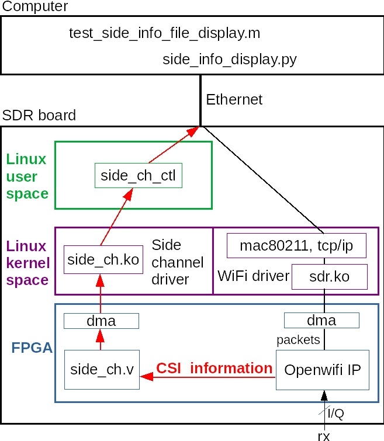

*The side-channel data path: the FPGA `side_ch` core captures data and DMAs it to the board's processor; `side_ch_ctl` forwards it over UDP (port 4000) to a display/analysis script on your PC.*

Two ways to build the side-channel pieces:

```bash
# side_ch.ko (on host):
$OPENWIFI_DIR/driver/side_ch/make_driver.sh $OPENWIFI_DIR $XILINX_DIR $ARCH_BIT   # ARCH_BIT: 32 or 64
# side_ch_ctl (compile ON the board):
gcc -o side_ch_ctl side_ch_ctl.c
```

`side_ch_ctl` uses a compact command syntax you'll see throughout this page:

- `./side_ch_ctl whXhY`: **w**rite register **X** with **h**ex value **Y**
- `./side_ch_ctl whXdY`: write register X with **d**ecimal value Y
- `./side_ch_ctl rhX`: read register X
- `./side_ch_ctl g` or `gN`: start capturing; `g` polls every 100 ms, `gN` every N ms

Everything below works not only in monitor mode but also alongside live AP/client/ad-hoc operation; bring the link up first, then start the side channel.

---

## CSI (Channel State Information)

openwifi extends "CSI" from *Channel* State Information to *Chip* State Information: per packet you can pull the **timestamp, frequency offset, channel response, and equalizer output** up to your PC.

### Quick start

```bash
# on the board:
cd openwifi
./wgd.sh
./monitor_ch.sh sdr0 11        # monitor a busy channel
insmod side_ch.ko
./side_ch_ctl g
```

If the printed "side info count" keeps climbing, CSI is flowing. Then, **on the PC** (not over ssh):

```bash
cd openwifi/user_space/side_ch_ctl_src
python3 side_info_display.py     # needs python3-numpy, python3-matplotlib, python3-tk
```

You'll get live plots of frequency offset, channel response, and the equalizer constellation, with the timestamp printed. Everything is also logged to `side_info.txt` for offline work with the MATLAB script `test_side_info_file_display.m`.

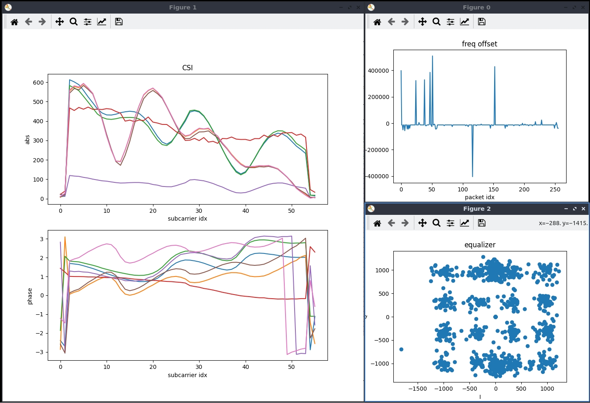

### Data format

Each element is 64-bit: a 64-bit TSF **timestamp** (identical to the value shown by tcpdump/Wireshark, which is how you map CSI to packets); **freq_offset** (first 16 bits used); and **csi** and **equalizer** (first two 16-bit words used for I/Q of the channel response and equalizer output; the rest reserved for future multi-antenna use). The Python and MATLAB scripts are the precise reference for parsing.

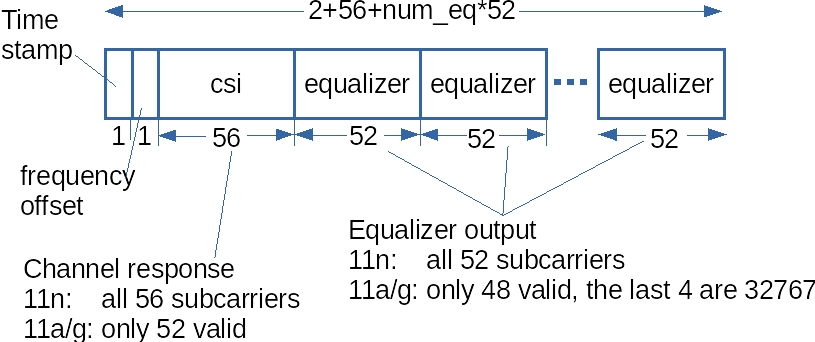

### Capturing only specific packets

By default you get CSI for every decoded packet. To filter by Frame Control, addr1 (target), or addr2 (source), configure register 1 before `g`. Bits of the value: `001` in the low 12 bits enables the feature; bit12 = FC match, bit13 = addr1 match, bit14 = addr2 match.

```bash
# Capture only packets from source MAC 56:5b:01:ec:e2:8f:
./side_ch_ctl wh1h4001          # enable addr2 (source) match
./side_ch_ctl wh7h01ece28f      # target addr2 = last 32 bits of the MAC
./side_ch_ctl g
```

Set the match targets with `wh5h<FC>` (Frame Control), `wh6h<addr1>`, `wh7h<addr2>`. Only the last 32 bits of a MAC are needed.

### num_eq (equalizer outputs)

Reduce how many equalizer outputs you capture (valid 0–8; default 8). Keep the value aligned across all three tools:

```bash
insmod side_ch.ko num_eq_init=3
python3 side_info_display.py 3      # and set num_eq=3 in the MATLAB script
```

---

## CSI radar (full-duplex self-sensing)

openwifi's baseband can receive its *own* transmit signal, so with a TX and an RX antenna (ideally two directional antennas facing the scene), the CSI of the self-TX signal reflects changes in the environment. That is joint radar-and-communication on a Wi-Fi platform.

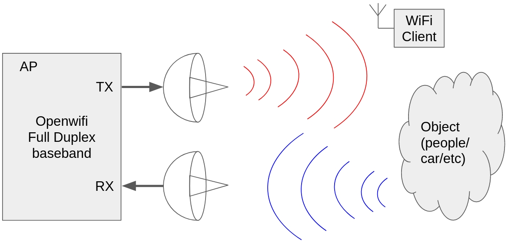

The recipe: bring up the latest driver+FPGA package, monitor a channel, restrict CSI to your own injector's source MAC, **unmute self-reception**, then inject a stream of packets to sound the channel:

```bash
# on the board, after loading drv_and_fpga.tar.gz and monitoring channel 1:
insmod ./drv_and_fpga/side_ch.ko
gcc -o side_ch_ctl side_ch_ctl.c
./side_ch_ctl wh1h4001
./side_ch_ctl wh7h4433225a          # only CSI from XX:XX:44:33:22:5a (our injector)
./sdrctl dev sdr0 set reg xpu 1 1   # UNMUTE baseband self-receive
./side_ch_ctl g0

# in a second ssh session, inject continuously:
cd /root/openwifi/inject_80211 && make
./inject_80211 -m g -r 4 -t d -e 0 -b 5a -n 99999999 -s 20 -d 1000 sdr0
# (802.11n variant: -m n -r 4 -t d -e 8 -b 5a ...)
```

Then on the PC, `python3 side_info_display.py 8 waterfall` shows CSI, a CSI waterfall, equalizer output, and frequency offset; the waterfall visibly changes as objects/people move between the antennas. Data logs to `side_info.txt` for offline analysis. The key control is `xpu` register 1 (`xpu 1 1` unmutes self-RX); read the [normal CSI section](#csi-channel-state-information) first to understand the plumbing.

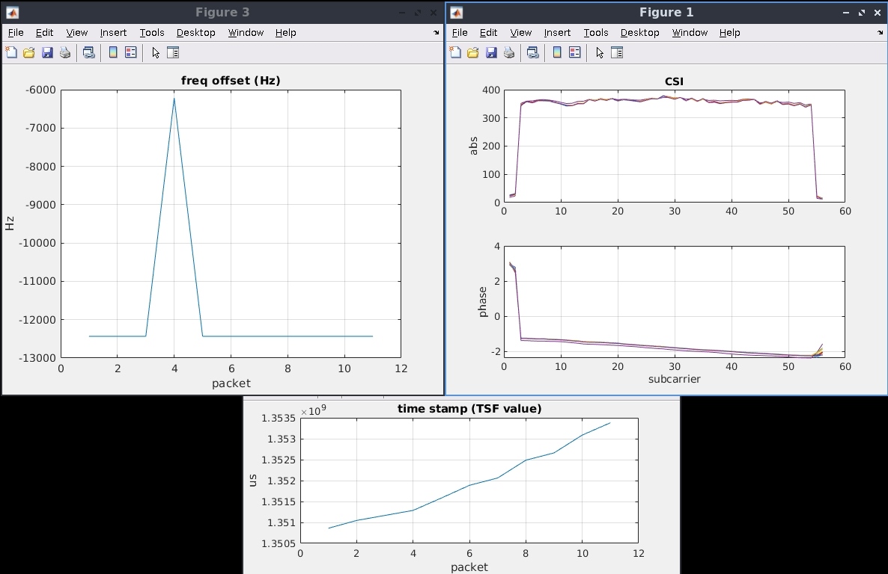

*Offline CSI-radar analysis: the waterfall plot shows the channel response changing over time as a person moves between the two directional antennas.*

---

## CSI fuzzer (privacy protection)

Wi-Fi CSI can be used to sense people and activity **passively and without consent** (keystrokes, presence, motion). The CSI fuzzer fights back by injecting a controlled *artificial* channel response into the transmitter, so an eavesdropper's CSI-based sensing is corrupted while normal communication continues. It's backed by peer-reviewed work ([ACM WiSec 2021](https://dl.acm.org/doi/pdf/10.1145/3448300.3468255); [privacy-protection paper](https://ieeexplore.ieee.org/abstract/document/10818006)).

<figure markdown>
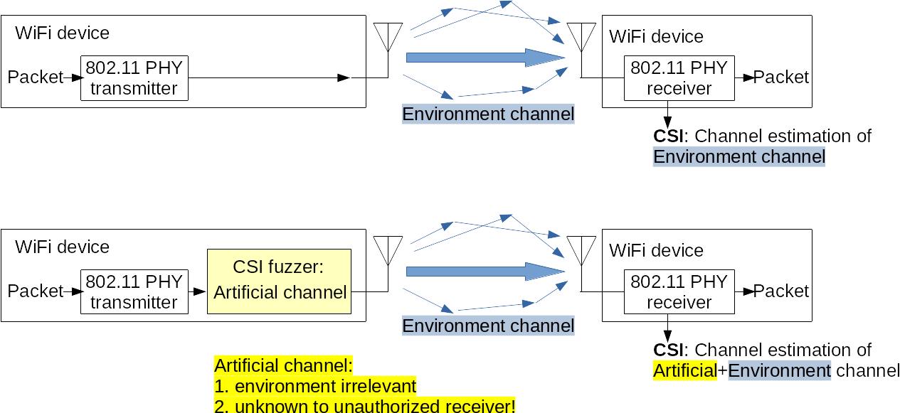
<figcaption>The problem and the fix: without the fuzzer an eavesdropper can passively sense you from your Wi-Fi signal; the fuzzer injects an artificial channel response so their CSI-based sensing is corrupted while your link keeps working.</figcaption>
</figure>

The fuzzer's principle, with the artificial CSI applied at the transmitter so it mixes with the real channel:

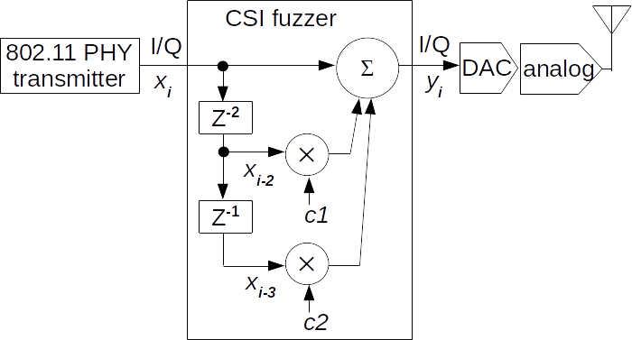

Thanks to full duplex, you can watch the artificial CSI you're creating via the same self-monitoring setup. First set up CSI self-monitoring as in [CSI radar](#csi-radar-full-duplex-self-sensing), then in another ssh session:

```bash
cd openwifi
./csi_fuzzer_scan.sh 1     # sweep artificial-CSI values (calls csi_fuzzer.sh)
```

The self-monitored CSI will visibly change. `csi_fuzzer.sh 1 45 0 13` applies one specific artificial response (its four arguments are a two-tap filter: `c1_rot90_en c1_raw c2_rot90_en c2_raw`, each raw value −64…63, packed into `tx_intf` register 5); `csi_fuzzer_scan.sh {1|2|3|4}` sweeps tap1, tap2, or their combinations across the full range by calling `csi_fuzzer.sh` repeatedly.

<div class="grid" markdown>
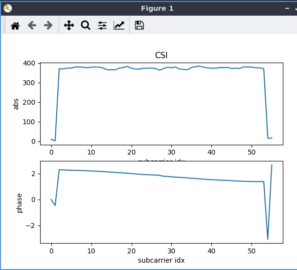

</div>

*Self-monitored beacon CSI before (left) and after (right) applying `./csi_fuzzer.sh 1 45 0 13`. The injected artificial response visibly reshapes the channel an eavesdropper would measure.*

---

## IQ capture

Capture raw baseband **IQ samples** with a wide set of trigger conditions, plus AD9361 **AGC gain and lock status**, **RSSI**, and a comparison of FPGA-estimated vs. Python-computed frequency offset.

### Quick start

```bash
# on the board:
./wgd.sh
./monitor_ch.sh sdr0 11
insmod side_ch.ko iq_len_init=8187      # small FPGA (Z7020): use <4096, e.g. 4095
./side_ch_ctl wh3h01                    # enable IQ capture, set IQ data source
./side_ch_ctl wh11d4094                 # only needed on zed / adrv9364z7020 / zc702
./side_ch_ctl g
```

Rising "side info count" means triggers are firing. Then on the PC:

```bash
cd openwifi/user_space/side_ch_ctl_src
python3 iq_capture.py                    # small FPGA: pass the iq_len, e.g. 4095
```

You'll see live IQ, AGC gain + lock status, and uncalibrated RSSI, with the timestamp printed; data logs to `iq.txt` for `test_iq_file_display.m` (set `iq_len` to match in the MATLAB script).

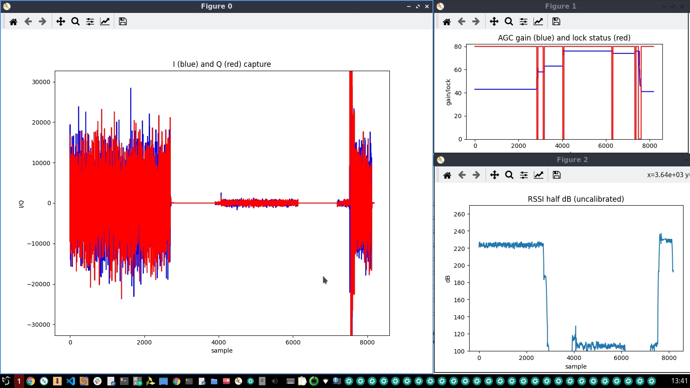

### Format

Each 64-bit element: a 64-bit TSF **timestamp** (moment the trigger fired); then per sample, two 16-bit words of **I/Q** from the active antenna, one 16-bit word of **AD9361 AGC gain** (bit7 = lock/unlock, bits6-0 = gain), and one 16-bit word of **uncalibrated RSSI** (half-dB).

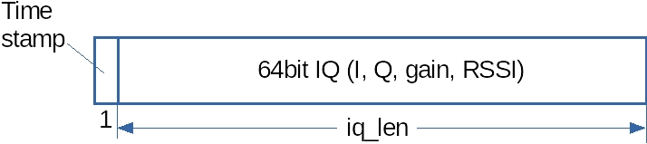

The capture is windowed around a trigger event: `iq_len` total samples, of which `pre_trigger_len` come *before* the trigger.

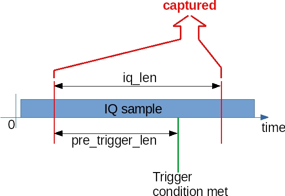

### iq_len and pre_trigger_len

- **`iq_len`** = samples captured per trigger. Set once at insert time: `insmod side_ch.ko iq_len_init=3000` (valid 1–8187; small FPGA 1–4095). You must specify `iq_len_init` to enable IQ mode; inserting `side_ch.ko` with no parameter runs CSI mode instead. Keep the value aligned across `side_ch.ko`, `iq_capture.py`, and the MATLAB script.
- **`pre_trigger_len`** = how many samples *before* the trigger are included: `./side_ch_ctl wh11dY` (valid 0–8190; small FPGA 0–4094).

### Trigger conditions (register 8)

`./side_ch_ctl wh8dY` selects the trigger (0–31). The most useful:

| Y | Trigger |
|---|---|
| 0 | FCS checked (pass or fail), or free-run |
| 1 / 2 | FCS pass / FCS fail |
| 3 | `tx_intf_iq0` becomes non-zero (first IQ out) |
| 4 / 5 | SIGNAL-field checksum pass / fail |
| 6 / 7 | SIGNAL checked, HT / non-HT packet |
| 8 / 9 | Long / short preamble detected |
| 10 / 11 | RSSI crosses above / below threshold |
| 12 / 13 | AGC lock→unlock / unlock→lock |
| 14 / 15 | AGC gain crosses above / below threshold |
| 16 | `tx_control_state` hits a target value (set via `wh5`) |
| 17 | `phy_tx_done` from the OFDM TX core |
| 18–21 | Edges of `tx_bb_is_ongoing` / `tx_rf_is_ongoing` |
| 22 / 23 | `phy_tx_started` / `phy_tx_done`, packet needs ACK |
| 24 | `tx_control_state` **and** phy_type (0 Legacy, 1 HT, 2 HE) both hit (via `wh5`) |
| 25 | addr1 and/or addr2 matched (configure like the CSI filter) |
| 26–31 | ACK-related TX edges and dual-antenna collision conditions |

Thresholds: RSSI via `wh9dY` (0–2047), AGC gain via `wh10dY` (0–127). For free-run, use `wh8d0` **and** `wh5d1` together. Register 5 is multi-purpose (bit0 free-run, bits7-4 `tx_control_state` target, bits9-8 phy_type); e.g. `wh5h230` targets `tx_control_state=SEND_BLK_ACK(3)` and `phy_type=HE(2)`.

### Frequency-offset check and SNR

- `iq_capture_freq_offset.py` prints FPGA-estimated vs. Python-computed frequency offset; if they diverge, override the FPGA estimate with `receiver_phase_offset_override.sh`. (Change `LUT_SIZE` in the script when testing 802.11ax.) The note's example uses `iq_len_init=1500`, addr1+addr2 match (trigger 25), or "long preamble detected" (trigger 8) on a clean channel.
- `show_iq_snr.m` computes SNR from a captured `.mat` file: run `show_iq_snr(mat_file)` to eyeball the RSSI mid-point, then `show_iq_snr(mat_file, middle_value)` to get the number. Do this with a single clean signal source (e.g. cable test) for meaningful results.

### Dual-antenna IQ (collision capture)

On AD9361 boards (FMCOMMS2/3, ADRV9361-Z7035) you can capture IQ from the *monitoring* antenna (rx1) coherently alongside the main antenna (rx0). Place rx1 near a peer node to catch collisions, moments when both link ends transmit at once. Set rx1's AGC to manual at a low gain in `rf_init.sh` (`echo manual > in_voltage1_gain_control_mode`; `echo 20 > in_voltage1_hardwaregain`), then use a short `pre_trigger_len` and a TX-done trigger (`wh8d23`), or the dedicated collision trigger (`wh8d29`, rx1 IQ above threshold while this SDR is transmitting). Capture with `iq_capture_2ant.py`. Full recipe in the [dual-antenna IQ note](https://github.com/open-sdr/openwifi/blob/master/doc/app_notes/iq_2ant.md).

<figure markdown>
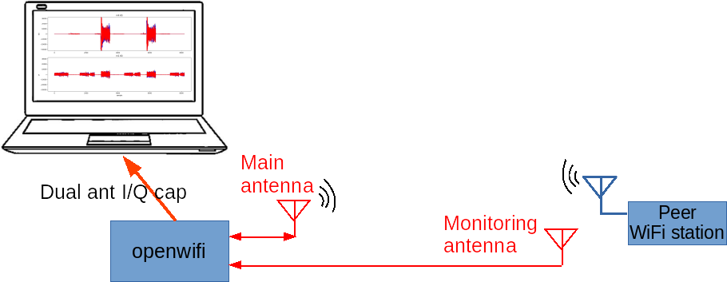{ width="520" }
<figcaption>Setup: the main antenna (rx0) handles comms and capture; a second monitoring antenna (rx1), placed near the peer, catches collisions.</figcaption>
</figure>

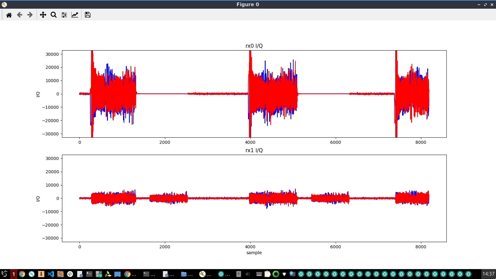

### ACK timing measurement

Because you can trigger IQ capture on the ACK-send event, you can directly measure ACK timing: the Rx-ACK-GAP and Tx-ACK-GAP that should sit around a 16 µs SIFS. Keep the receiver always on (`xpu 1 1`), configure `wh3h21` for the right IQ composition, `wh5h20` / `wh8d16` for the trigger, and capture with `g0`. Generate traffic (e.g. a `ping` sweep of payload sizes across all MCS from a second board), then analyze offline with `test_iq_file_ack_timing_display.m`. See the [ACK-timing note](https://github.com/open-sdr/openwifi/blob/master/doc/app_notes/iq_ack_timing.md).

<figure markdown>
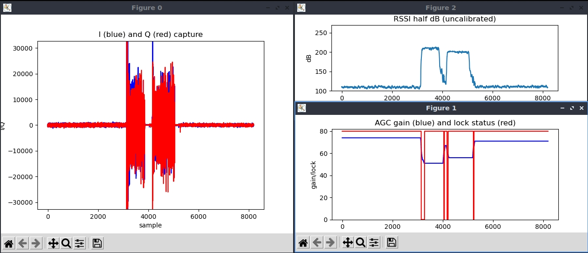
<figcaption>A live capture showing the data packet and its ACK ~16 µs (≈320 samples) apart, the SIFS-based ACK timing.</figcaption>
</figure>

This technique is precise enough to have caught real bugs: the plot below shows abnormal Tx-ACK-GAPs (a ~12 µs gap and a "−1" no-event) that traced back to AGC-induced DC power before the ACK being mis-detected as the ACK start, since fixed.

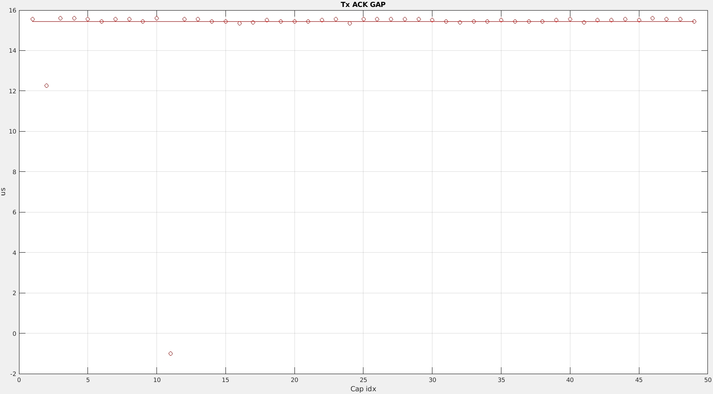

---

## Self-loopback testing

Full duplex also enables self-loopback tests of packets, CSI, and IQ, either over the air (TX/RX antennas close together) or entirely inside the FPGA. This is a good sanity check for the transmitter and receiver without a second node.

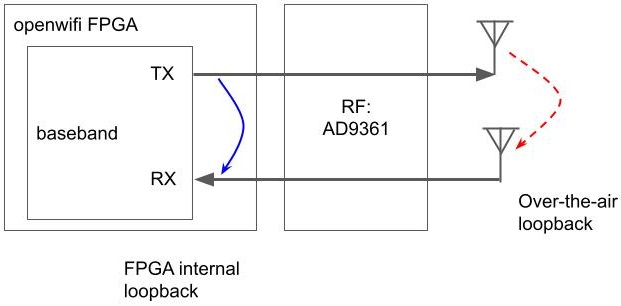

The essential ingredients are: monitor mode, CCA effectively disabled (`xpu 8 <big>`), self-RX unmuted (`xpu 1 1`), a TX-start trigger, and the loopback source select (`side_ch_ctl wh5h0` for over-the-air, `wh5h4` for FPGA-internal). Inject a packet in a second ssh session (`./inject_80211 -m n -r 5 -n 1 sdr0`) to fire the capture.

<div class="grid" markdown>
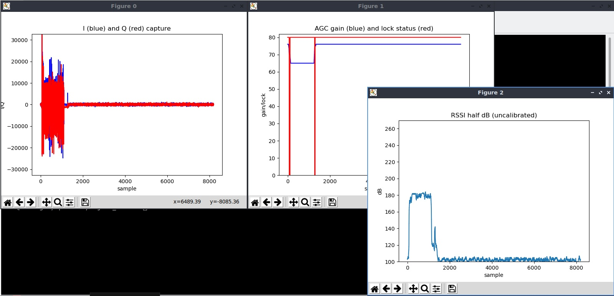
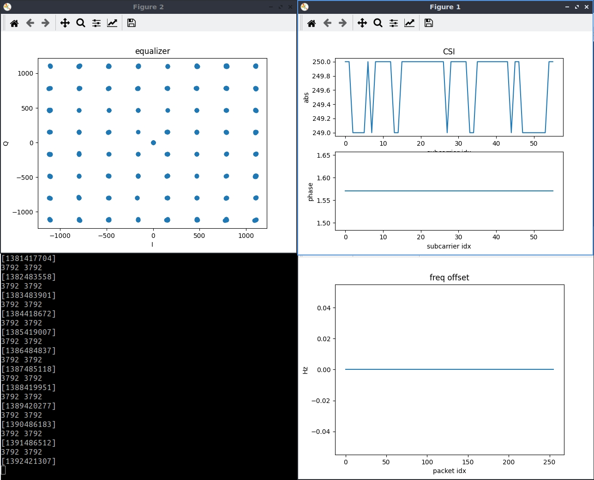
</div>

*Left: IQ captured from an over-the-air self-loopback packet. Right: CSI/constellation over the ideal FPGA-internal loopback channel, useful as a "golden" reference since it has no real-channel distortion.*

Full walkthrough in the [loopback note](https://github.com/open-sdr/openwifi/blob/master/doc/app_notes/packet-iq-self-loopback-test.md).

---

## Counters and statistics

### Driver-level (sysfs)

Comprehensive per-packet TX/RX counters are on the [sdrctl page](sdrctl-and-Runtime-Control.md#statistics-via-sysfs): `stat_enable.sh`, `tx_stat_show.sh`, `rx_stat_show.sh` (with PER calculation), `tx_prio_queue_show.sh`, `rx_gain_show.sh`, per-peer filtering, and ACK inclusion.

### FPGA event counters

Two additional counter sources live in the FPGA:

**openofdm_rx watchdog counters**: the `signal_watchdog` inside `openofdm_rx` detects abnormal signals early so the receiver isn't tied up chasing junk. Select an event with `sdrctl dev sdr0 set reg rx 17 <type>` (0 = phase offset too big, 1 = too many small equalizer outputs, 2 = DC / slow sine detected, 3 = packet too short, 4 = packet too long), read the count with `get reg rx 30`, and clear it by writing any value to reg 30.

**Side-channel PHY RX/TX counters**: after `insmod side_ch.ko`, registers 26–31 count paired events (each register has two selectable sources chosen by bits in register 19), e.g. short/long preamble detected, `phy_tx_start`/`phy_tx_done`, header-valid strobes, RSSI-above-threshold, AGC lock/gain-change, and "data packet for me with good FCS." Set the addr2 target in register 7 and the RSSI-event threshold in register 9; read a counter with `rhX`; reset one by writing any value to registers 26–31. The exact event→register mapping is in the [FPGA counter note](https://github.com/open-sdr/openwifi/blob/master/doc/app_notes/perf_counter.md).

### High-rate register logging (`fast_reg_log`)

For microsecond-resolution traces of radio state, the `user_space/fast_reg_log/` tool memory-maps the XPU register BRAM through `/dev/mem` and tight-loops reading two registers as fast as the CPU allows: **XPU reg 57** (a packed status word holding `rssi_half_db`, AGC lock/gain, `demod_is_ongoing`, `tx_is_ongoing`, and `ch_idle`) and **XPU reg 58** (the low 32 bits of the TSF). It dumps millions of samples to `fast_reg_log.bin`, which `fast_reg_log_analyzer.m` decodes and plots against the TSF timeline. That is far faster than polling through `sdrctl`/sysfs, and useful for studying CSMA/CA timing, AGC behavior, and channel occupancy at fine granularity.
